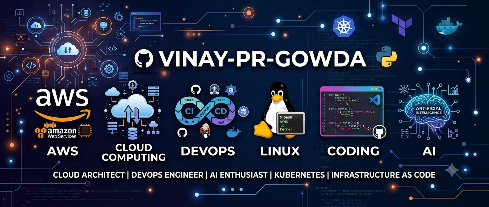

# Hi, I'm Vinay 👋

Aspiring Cloud/DevOps Engineer based in Bangalore, India.

## 🔧 Skills
- Cloud: AWS
- OS: Linux
- Languages: Python, Shell Scripting
- Tools: Git, GitHub

## 📌 Currently
Building hands-on projects in cloud infrastructure and automation.

## 📫 Reach me
- LinkedIn: https://www.linkedin.com/in/vinay-gowda-754240416/?skipRedirect=true
- Email: vinaygowda19122005@gmail.com

- ## 📊 GitHub Stats

## 🌱 Currently Learning

- AWS
- Docker
- Kubernetes
- Terraform
- CI/CD
- Linux

- ---

## 💡 Quote

> Learn. Adapt. Evolve.
